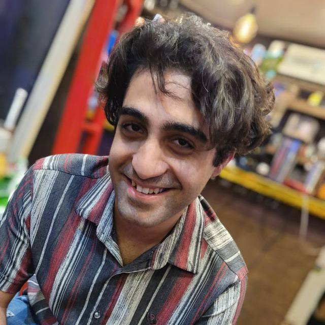

# CNAV Lab - Autonomous Systems Repository 🚁

Welcome to the CNAV Lab's Autonomous Systems repository on GitHub!
CNAV stands for **Control and Navigation for Autonomous Vehicles**.

  

## Overview 📚

This repository is your gateway to our research and projects in the interconnected realms of:

- 🌐 Navigation
- 🤖 Artificial Intelligence
- 🎛️ Automatic Control
- 🌍 Embedded Systems
- 🚁 Quadrotor Technology
- 📷 Image Processing

## Contents 📂

The repository is organized by focus area so you can quickly locate documentation, datasets, and source code for each active initiative.

## Key Projects 🔑

Explore some of our featured projects:

- [Project 1](link_to_project_1): Jump with Diano
- [Project 2](link_to_project_2): Cubli
- [Project 3](link_to_project_3): Quadrotor Regulation

## Getting Started 🚀

Refer to the project-level README files for installation tips, usage examples, and contribution guidelines tailored to each workflow.

## Contributions 🤝

We welcome pull requests, issues, and collaboration proposals. Please review the guidance in `CONTRIBUTING.md` before submitting changes.

## Contact Us 📩

Questions, suggestions, or collaboration ideas? Reach us at:

- [Website](http://ae.sharif.edu/~cnavlab)
- [Email](mailto:cnavlab@ae.sharif.edu)
- [LinkedIn](https://www.linkedin.com/company/cnallab)

Thank you for visiting our Autonomous Systems repository. We look forward to sharing new research with you! 🚀🌟

## CNAV Lab People

  MEET THE TEAM

### Leadership

  

    

      
    

    <h3 style="margin: 1.25rem 0 0.35rem; text-align: center;">Alireza Sharifi</h3>
    
Supervisor

    

      <a href="mailto:alibaniasad1999@yahooe.com" style="text-decoration: none; background: #e0e7ff; color: #1e1b4b; padding: 0.35rem 0.85rem; border-radius: 999px; font-size: 0.85rem; font-weight: 600;">✉️ Email</a>
      <a href="https://github.com/alibaniasad1999" style="text-decoration: none; background: #d1fae5; color: #064e3b; padding: 0.35rem 0.85rem; border-radius: 999px; font-size: 0.85rem; font-weight: 600;">🐙 GitHub</a>
      <a href="https://t.me/alibaniasad1999" style="text-decoration: none; background: #dbeafe; color: #1d4ed8; padding: 0.35rem 0.85rem; border-radius: 999px; font-size: 0.85rem; font-weight: 600;">📨 Telegram</a>
    

  

  

    

      
    

    <h3 style="margin: 1.25rem 0 0.35rem; text-align: center;">Ali BaniAsad</h3>
    
Head

    

      <a href="mailto:alibaniasad1999@yahooe.com" style="text-decoration: none; background: #e0e7ff; color: #1e1b4b; padding: 0.35rem 0.85rem; border-radius: 999px; font-size: 0.85rem; font-weight: 600;">✉️ Email</a>
      <a href="https://github.com/alibaniasad1999" style="text-decoration: none; background: #d1fae5; color: #064e3b; padding: 0.35rem 0.85rem; border-radius: 999px; font-size: 0.85rem; font-weight: 600;">🐙 GitHub</a>
      <a href="https://t.me/alibaniasad1999" style="text-decoration: none; background: #dbeafe; color: #1d4ed8; padding: 0.35rem 0.85rem; border-radius: 999px; font-size: 0.85rem; font-weight: 600;">📨 Telegram</a>
    

  

  

    

      
    

    <h3 style="margin: 1.25rem 0 0.35rem; text-align: center;">Reza Pordal</h3>
    
Co-Head

    

      <a href="mailto:alibaniasad1999@yahooe.com" style="text-decoration: none; background: #e0e7ff; color: #1e1b4b; padding: 0.35rem 0.85rem; border-radius: 999px; font-size: 0.85rem; font-weight: 600;">✉️ Email</a>
      <a href="https://github.com/alibaniasad1999" style="text-decoration: none; background: #d1fae5; color: #064e3b; padding: 0.35rem 0.85rem; border-radius: 999px; font-size: 0.85rem; font-weight: 600;">🐙 GitHub</a>
      <a href="https://t.me/alibaniasad1999" style="text-decoration: none; background: #dbeafe; color: #1d4ed8; padding: 0.35rem 0.85rem; border-radius: 999px; font-size: 0.85rem; font-weight: 600;">📨 Telegram</a>
    

  

### Researchers

  

    

      
    

    <h4 style="margin: 1rem 0 0.3rem; text-align: center;">Hossein Mirsaeidi</h4>
    
Senior Researcher

    

      <a href="mailto:alibaniasad1999@yahooe.com" style="text-decoration: none; background: #e0e7ff; color: #1e1b4b; padding: 0.3rem 0.75rem; border-radius: 999px; font-size: 0.82rem; font-weight: 600;">✉️ Email</a>
      <a href="https://github.com/alibaniasad1999" style="text-decoration: none; background: #d1fae5; color: #064e3b; padding: 0.3rem 0.75rem; border-radius: 999px; font-size: 0.82rem; font-weight: 600;">🐙 GitHub</a>
      <a href="https://t.me/alibaniasad1999" style="text-decoration: none; background: #dbeafe; color: #1d4ed8; padding: 0.3rem 0.75rem; border-radius: 999px; font-size: 0.82rem; font-weight: 600;">📨 Telegram</a>
    

  

  

    

      
    

    <h4 style="margin: 1rem 0 0.3rem; text-align: center;">Mohammad Nayebi</h4>
    
Researcher

    

      <a href="mailto:alibaniasad1999@yahooe.com" style="text-decoration: none; background: #e0e7ff; color: #1e1b4b; padding: 0.3rem 0.75rem; border-radius: 999px; font-size: 0.82rem; font-weight: 600;">✉️ Email</a>
      <a href="https://github.com/alibaniasad1999" style="text-decoration: none; background: #d1fae5; color: #064e3b; padding: 0.3rem 0.75rem; border-radius: 999px; font-size: 0.82rem; font-weight: 600;">🐙 GitHub</a>
      <a href="https://t.me/alibaniasad1999" style="text-decoration: none; background: #dbeafe; color: #1d4ed8; padding: 0.3rem 0.75rem; border-radius: 999px; font-size: 0.82rem; font-weight: 600;">📨 Telegram</a>
    

  

  

    

      
    

    <h4 style="margin: 1rem 0 0.3rem; text-align: center;">Sepehr Mahfar</h4>
    
Researcher

    

      <a href="mailto:alibaniasad1999@yahooe.com" style="text-decoration: none; background: #e0e7ff; color: #1e1b4b; padding: 0.3rem 0.75rem; border-radius: 999px; font-size: 0.82rem; font-weight: 600;">✉️ Email</a>
      <a href="https://github.com/alibaniasad1999" style="text-decoration: none; background: #d1fae5; color: #064e3b; padding: 0.3rem 0.75rem; border-radius: 999px; font-size: 0.82rem; font-weight: 600;">🐙 GitHub</a>
      <a href="https://t.me/alibaniasad1999" style="text-decoration: none; background: #dbeafe; color: #1d4ed8; padding: 0.3rem 0.75rem; border-radius: 999px; font-size: 0.82rem; font-weight: 600;">📨 Telegram</a>
    

  

  

    

      
    

    <h4 style="margin: 1rem 0 0.3rem; text-align: center;">Amir Baharvand</h4>
    
Researcher

    

      <a href="mailto:alibaniasad1999@yahooe.com" style="text-decoration: none; background: #e0e7ff; color: #1e1b4b; padding: 0.3rem 0.75rem; border-radius: 999px; font-size: 0.82rem; font-weight: 600;">✉️ Email</a>
      <a href="https://github.com/alibaniasad1999" style="text-decoration: none; background: #d1fae5; color: #064e3b; padding: 0.3rem 0.75rem; border-radius: 999px; font-size: 0.82rem; font-weight: 600;">🐙 GitHub</a>
      <a href="https://t.me/alibaniasad1999" style="text-decoration: none; background: #dbeafe; color: #1d4ed8; padding: 0.3rem 0.75rem; border-radius: 999px; font-size: 0.82rem; font-weight: 600;">📨 Telegram</a>
    

  

