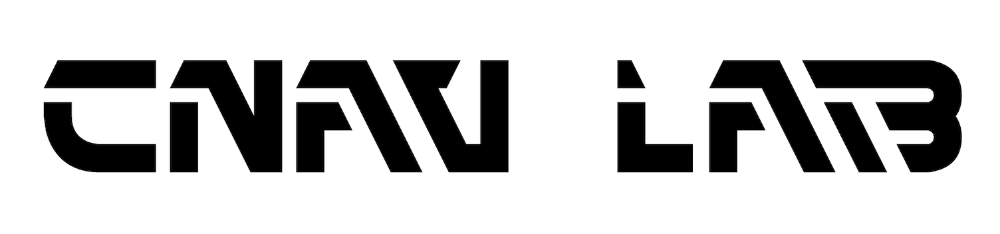
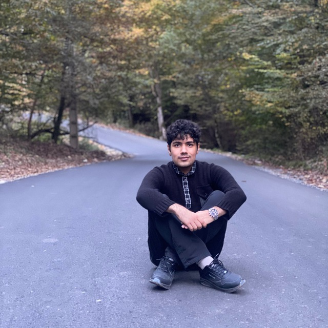
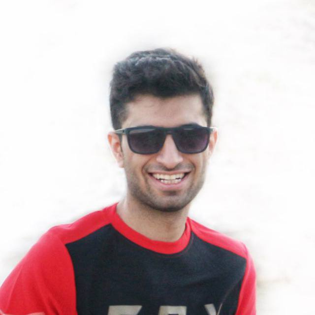
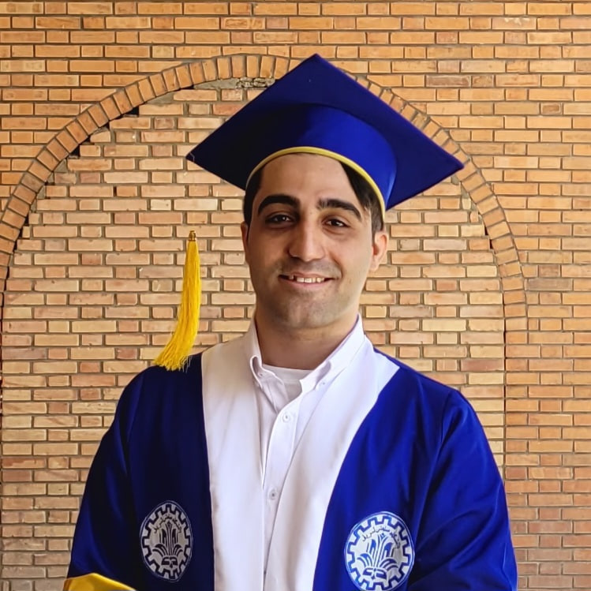
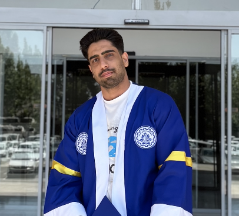

<div align="center">

# 🚁 CNAV Lab - Autonomous Systems

### Control and Navigation for Autonomous Vehicles

<p align="center">
  
</p>

[](http://ae.sharif.edu/~cnavlab)
[](mailto:cnavlab@ae.sharif.edu)
[](https://www.linkedin.com/company/cnallab)

---

### *Pioneering Innovation in Autonomous Systems & Robotics*

</div>

<br>

## 🌟 About Us

Welcome to **CNAV Lab** – where cutting-edge research meets practical innovation in autonomous systems. Our laboratory is dedicated to advancing the frontiers of intelligent robotics through interdisciplinary research and collaborative development.

<br>

## 🔬 Research Areas

<table>
<tr>
<td width="33%" align="center">

### 🌐 Navigation
Advanced positioning and path planning systems

</td>
<td width="33%" align="center">

### 🤖 Artificial Intelligence
Machine learning and intelligent decision-making

</td>
<td width="33%" align="center">

### 🎛️ Automatic Control
Robust control systems and optimization

</td>
</tr>
<tr>
<td width="33%" align="center">

### 🌍 Embedded Systems
Real-time computing and hardware integration

</td>
<td width="33%" align="center">

### 🚁 Quadrotor Technology
UAV systems and autonomous flight

</td>
<td width="33%" align="center">

### 📷 Image Processing
Computer vision and perception systems

</td>
</tr>
</table>

<br>

## 🎯 Featured Projects

<table>
<tr>
<td width="33%">

### 🦘 Jump with Diano
Advanced locomotion control system for dynamic movement
<br><br>
**Status:** 🟢 Active  
[Learn More →](link_to_project_1)

</td>
<td width="33%">

### 📦 Cubli
Self-balancing cube with advanced control algorithms
<br><br>
**Status:** 🟢 Active  
[Learn More →](link_to_project_2)

</td>
<td width="33%">

### 🚁 Quadrotor Regulation
Precision control for autonomous aerial vehicles
<br><br>
**Status:** 🟢 Active  
[Learn More →](link_to_project_3)

</td>
</tr>
</table>

<br>

## 🚀 Getting Started

Each project contains detailed documentation to help you get up and running quickly:

```bash
# Clone the repository
git clone https://github.com/your-org/cnavlab.git

# Navigate to a specific project
cd cnavlab/project-name

# Follow project-specific README for setup
```

📖 **Detailed guides available in each project's directory**

<br>

## 👥 Meet Our Team

<div align="center">
  
### 🌟 **Driving Innovation Through Collaboration** 🌟

</div>

<br>

### 🎓 Leadership Team

<table>
  <tr>
    <td align="center" width="33%">
      
      <br><br>
      <h3>🔬 Alireza Sharifi</h3>
      <p><i>Laboratory Supervisor</i></p>
      <p>⭐ <b>Leading Research Excellence</b></p>
      <br>
      <p>
        <a href="mailto:alibaniasad1999@yahoo.com">📧 Email</a> •
        <a href="https://github.com/alibaniasad1999">💻 GitHub</a> •
        <a href="https://t.me/alibaniasad1999">💬 Telegram</a>
      </p>
    </td>
    <td align="center" width="33%">
      
      <br><br>
      <h3>👨‍💼 Ali BaniAsad</h3>
      <p><i>Laboratory Head</i></p>
      <p>⭐ <b>Strategic Leadership</b></p>
      <br>
      <p>
        <a href="mailto:alibaniasad1999@yahoo.com">📧 Email</a> •
        <a href="https://github.com/alibaniasad1999">💻 GitHub</a> •
        <a href="https://t.me/alibaniasad1999">💬 Telegram</a>
      </p>
    </td>
    <td align="center" width="33%">
      
      <br><br>
      <h3> Reza Pordal</h3>
      <p><i>Laboratory Co-Head</i></p>
      <p>⭐ <b>Collaborative Innovation</b></p>
      <br>
      <p>
        <a href="mailto:r.pordal@yahoo.com">📧 Email</a> •
        <a href="https://github.com/Faivex">💻 GitHub</a> •
        <a href="https://t.me/favex">💬 Telegram</a>
      </p>
    </td>
  </tr>
</table>

<br><br>

### 🔍 Research Team

<table>
  <tr>
    <td align="center" width="25%">
      
      <br><br>
      <h4>✨ Hossein Mirsaeidi</h4>
      <p><b>Senior Researcher</b></p>
      <p><sub>🏆 Control Theory & Multi-Agent Systems </sub></p>
      <br>
      <p>
        <a href="mailto:alibaniasad1999@yahoo.com">📧</a> •
        <a href="https://github.com/alibaniasad1999">💻</a> •
        <a href="https://t.me/alibaniasad1999">💬</a>
      </p>
    </td>
    <td align="center" width="25%">
      
      <br><br>
      <h4>🛩 Mohammad Nayebi</h4>
      <p><b>Researcher</b></p>
      <p><sub>Navigation 🗺 & AI 🧠</sub></p>
      <br>
      <p>
        <a href="mailto:mohammadnayebi8203@gmail.com">📧</a> •
        <a href="https://github.com/mohammadnayebi">💻</a> •
        <a href="https://t.me/Mohammad_Nayebi82">💬</a>
      </p>
    </td>
    <td align="center" width="25%">
      
      <br><br>
      <h4> Sepehr Mahfar</h4>
      <p><b>Researcher</b></p>
      <p><sub> Robotic & Control Theory</sub></p>
      <br>
      <p>
        <a href="mailto:sepehr.mahfar81@gmail.com">📧</a> •
        <a href="https://github.com/Sepishoon">💻</a> •
        <a href="https://t.me/sepehr_mahfar">💬</a>
      </p>
    </td>
    <td align="center" width="25%">
      
      <br><br>
      <h4>💡 Amir Baharvand</h4>
      <p><b>Researcher</b></p>
      <p><sub>📷 Computer Vision</sub></p>
      <br>
      <p>
        <a href="mailto:alibaniasad1999@yahoo.com">📧</a> •
        <a href="https://github.com/alibaniasad1999">💻</a> •
        <a href="https://t.me/alibaniasad1999">💬</a>
      </p>
    </td>
  </tr>

  <!-- New Row -->
  <tr>
    <td align="center" width="25%">
      
      <br><br>
      <h4>🛰️ Amir Eslami</h4>
      <p><b>Researcher</b></p>
      <p><sub>🧭 Autonomous Navigation</sub></p>
      <br>
      <p>
        <a href="mailto:amir81mlm@gmail.com">📧</a> •
        <a href="https://github.com/Amir81Eslami">💻</a> •
        <a href="https://t.me/amiesl">💬</a>
      </p>
    </td>
  </tr>
  
</table>

<br>

## 🤝 Contributing

We welcome contributions from the community! Whether you're fixing bugs, adding features, or improving documentation, your help is appreciated.

**Before contributing:**
1. 📖 Read our `CONTRIBUTING.md` guidelines
2. 🔍 Check existing issues and pull requests
3. 💬 Discuss major changes in an issue first

<br>

## 📬 Get In Touch

<div align="center">

Have questions, suggestions, or collaboration ideas?

**We'd love to hear from you!**

[](http://ae.sharif.edu/~cnavlab)
[](mailto:cnavlab@ae.sharif.edu)
[](https://www.linkedin.com/company/cnallab)

</div>

<br>

---

<div align="center">

### ⭐ Star us on GitHub — it motivates us a lot!

**© 2024 CNAV Lab | Sharif University of Technology**

*Advancing Autonomous Systems for a Better Tomorrow* 🚀

</div>
